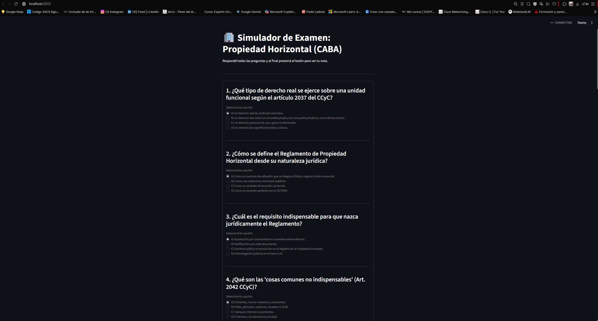

# 🏢 Proyecto: Simulador de Examen Multiple Choice para Administración de Consorcios (CABA)

Este repositorio documenta el desarrollo y despliegue de mi primer proyecto integral en Python. Se trata de un simulador de examen interactivo basado en la normativa legal y contable de Propiedad Horizontal (Código Civil y Comercial de la Ciudad Autónoma de Buenos Aires), diseñado específicamente para practicar y rendir con éxito ante el Consejo de Administradores.

A lo largo de este proyecto, evolucioné el software desde un script básico de consola hasta transformarlo en una aplicación web moderna y accesible mediante un enlace público.

:smile: :clap: **Adjuntos las imágenes por si les sirve el proceso de creación de cada paso para su proyectos** :smile: :clap:

**1**

**2**

**3**

**4**

**5**

**6**

**7**

**8**

**9**

**10**

:clap: :clap: **La pagina funciona correctamente para practicar el examen.** :clap: :clap:
Muchas gracias por ver mi portafolio. Les envio un saludo grande. 
**11 todo funcionando**

---

## 🛠️ Fase 1: Desarrollo de la Lógica y Script en Consola (CLI)

### Paso 1: Configuración del Entorno de Desarrollo (IDLE)

Para dar los primeros pasos en la programación, utilicé IDLE, el entorno integrado que viene por defecto al instalar Python en Windows.

* Accedí al menú de Inicio, busqué IDLE y abrí la consola interactiva (`>>>`).
* Creé un nuevo archivo en blanco seleccionando File > New File, lo que abrió el editor de código listo para escribir el script.

### Paso 2: Programación de la Estructura del Examen

Diseñé el cuestionario completo con preguntas de opción múltiple enfocadas en los aspectos legales, administrativos y contables de la propiedad horizontal en CABA.

* Utilicé una estructura de datos basada en una lista de diccionarios en Python, donde cada elemento almacena de forma ordenada la pregunta, sus respectivas opciones y la respuesta correcta.
* El código fuente de esta versión inicial quedó guardado en el archivo simulador_consorcio.py.

### Paso 3: Optimización y Validación con Bucles (while)

Durante las primeras pruebas en la consola, noté un "caso borde": si un usuario ingresaba por error una letra no contemplada, el programa podía fallar o comportarse de manera inesperada.

* Para solucionar esto, implementé una validación de entrada utilizando la estructura de control while.
* Mediante este bucle condicional, el programa evalúa permanentemente la respuesta ingresada y no permite avanzar a la siguiente pregunta a menos que el carácter introducido pertenezca estrictamente a las opciones válidas. En caso contrario, emite un aviso de error amigable y vuelve a solicitar el ingreso correcto.

### Paso 4: Guardado y Ejecución Local (F5)

* Guardé el archivo en mi equipo bajo el nombre simulador_consorcio.py.
* Utilicé la opción Run > Run Module (o la tecla F5 del teclado) para ejecutar el script directamente desde IDLE, verificando que el flujo de preguntas, la validación de errores y el cálculo de la nota final funcionaran a la perfección.

---

## 📦 Fase 2: Empaquetado y Creación del Archivo Ejecutable (.exe)

Para poder compartir la herramienta fácilmente con compañeros de estudio sin necesidad de que tengan Python instalado en sus computadoras, convertí el script en una aplicación independiente de Windows.

### Paso a paso del empaquetado:

1. **Apertura de la Terminal:** Abrí el Símbolo del sistema de Windows (`cmd`).
2. **Instalación de la herramienta de compilación:** Instalé la librería PyInstaller ejecutando el comando: `pip install pyinstaller`
3. **Ubicación en el directorio:** Navegué hasta la carpeta donde se encontraba mi archivo utilizando el comando: `cd C:\Users\Marcelo-Gestiones\OneDrive\Documentos`
4. **Generación del ejecutable:** Compilé el código en un único archivo autónomo ejecutando: `pyinstaller --onefile simulador_consorcio.py`
5. **Resultado:** Dentro de la carpeta generada dist, obtuve mi archivo final `simulador_examen_consorcio.exe`. Este archivo me permitió ejecutar el simulador haciendo un simple doble clic, listo para ser distribuido o copiado a un pendrive.

> **Nota sobre seguridad en Windows:** Como el ejecutable fue creado de forma local y no cuenta con una firma digital comercial corporativa, el sistema operativo puede mostrar una advertencia preventiva de SmartScreen al abrirlo por primera vez. Esto se resuelve de manera sencilla haciendo clic en "Más información" y luego en "Ejecutar de todas formas".

---

## 🌐 Fase 3: Evolución a Aplicación Web (Streamlit)

Para modernizar el proyecto y permitir que cualquier persona pueda realizar el examen desde su celular o computadora con un solo clic, migré la herramienta hacia una plataforma web interactiva utilizando Streamlit.

### Paso 1: Creación del entorno web (app_examen.py)

* Desarrollé un nuevo script adaptado a la interfaz gráfica web, utilizando componentes visuales como st.title, st.subheader, st.radio para la selección de opciones y contenedores interactivos.
* Añadí lógica de calificación instantánea con feedback detallado de aciertos/errores, cálculo de nota final y animaciones festivas (`st.balloons`) al aprobar el examen.

### Paso 2: Pruebas Locales del Servidor Web

Para evitar errores de ubicación y asegurarme de que la consola localizara el archivo sin inconvenientes, realicé los siguientes pasos en el Símbolo del sistema (`cmd`):

1. Me posicioné directamente en el directorio donde resguardo el script web: `cd C:\Users\Marcelo-Gestiones\OneDrive\Documentos`
2. Inicialicé el servidor de desarrollo local utilizando la ruta completa del ejecutable de Streamlit para garantizar su correcta ejecución: `"C:\Users\Marcelo-Gestiones\AppData\Local\Python\pythoncore-3.14-64\Scripts\streamlit.exe" run app_examen.py`
3. Automáticamente, el sistema levantó el servidor local e inició una pestaña en mi navegador web en la dirección `http://localhost:8501`, permitiéndome interactuar de manera fluida con la interfaz gráfica.

*(Adjuntar aquí tu captura de pantalla de la web app corriendo de forma local o en el navegador)*

### Paso 3: Despliegue en la Nube (Streamlit Community Cloud)

1. Subí el código fuente (`app_examen.py`) a este repositorio público en GitHub.
2. Me conecté a la plataforma gratuita de Streamlit Community Cloud, vinculé mi repositorio, seleccioné el archivo principal y completé el despliegue (Deploy), obteniendo un enlace web público y oficial.

> **🔗 Enlace a la Aplicación en Vivo:** Podés probar el simulador funcionando online haciendo clic en el siguiente enlace:
> 👉 [Simulador de Examen - Consorcio CABA](https://www.google.com/search?q=https://simulador-examen-consorcio.streamlit.app&utm_source=gemini)

---

## 🚀 Tecnologías y Herramientas Utilizadas

* **Lenguaje:** Python 3.x
* **Librerías / Frameworks:** Streamlit
* **Empaquetado:** PyInstaller
* **Control de Versiones:** Git y GitHub
* **Entornos:** IDLE, CMD (Símbolo del sistema de Windows), Google Chrome

---

## 🤝 Conclusión y Contacto

* **💼 LinkedIn**: [Horacio Marcelo Nuñez](https://linkedin.com) 
* **📬 Correo Electrónico**: [marcelonh86@gmail.com](marcelonh86@gmail.com)
* **🚀 GitHub**: [@MarceloNunez-NOC](https://github.com/MarceloNunez-NOC)

Agradezco el tiempo de quienes visitan mi portafolio en GitHub. Cada laboratorio refleja mi compromiso con el aprendizaje continuo y la práctica aplicada en IT, redes y administración de sistemas con programacion en python. Mi objetivo es demostrar que puedo diagnosticar, resolver y documentar incidentes de manera profesional, utilizando máquinas virtuales y configuraciones de red y programar de algo simple a cosas complejas. scrip de analisis y diagnostico como resolver incidentes si se me permite. 

Invito a reclutadores y colegas a seguir mis repositorios, donde iré compartiendo nuevos proyectos, certificados y logros. Estoy abierto a colaborar y aportar mi experiencia en entornos que valoren la constancia y la capacidad de resolver problemas.
